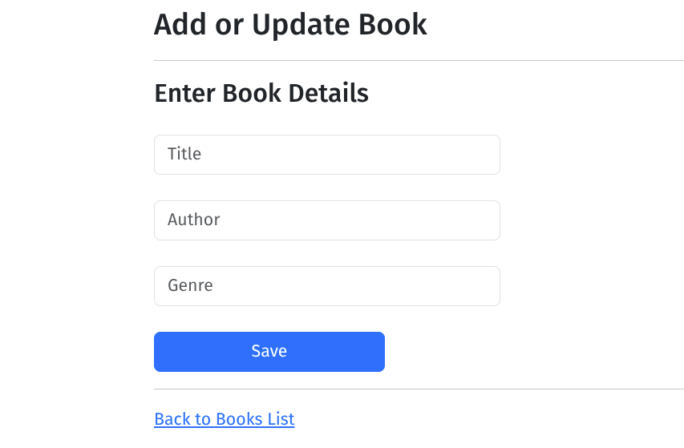

# Spring MVC Web Application

A full-stack web application built using **Java Spring MVC**, **Thymeleaf**, **Bootstrap**, and **MySQL**.

## 🧰 Tech Stack

- **Backend**: Spring MVC, Spring Boot
- **Frontend**: Thymeleaf, Bootstrap
- **Database**: MySQL
- **Build Tool**: Maven

## 📦 Features

- MVC-based architecture
- RESTful routing and controller handling
- Thymeleaf-powered dynamic views
- Bootstrap for basic styling
- MySQL integration with JPA/Hibernate
- Basic CRUD functionality

